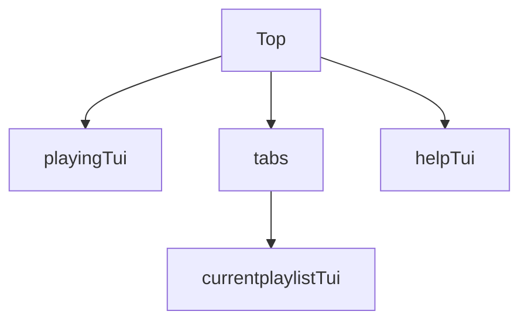

# lazyAppleMusic

this is an Apple Music TUI.  

## model

## BUG
- remain time sync

## TODO
- [ ] quick find current track in playlist
- [ ] add user's playlist
- [ ] search current playlist

## Maybe TODO
- cache album, playlist...

## Thank this article help me build this project

[Tips for building Bubble Tea programs](https://leg100.github.io/en/posts/building-bubbletea-programs/)
