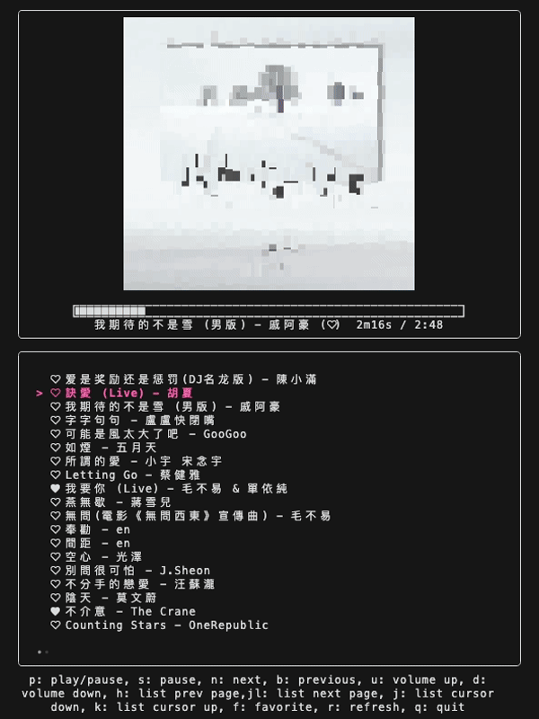
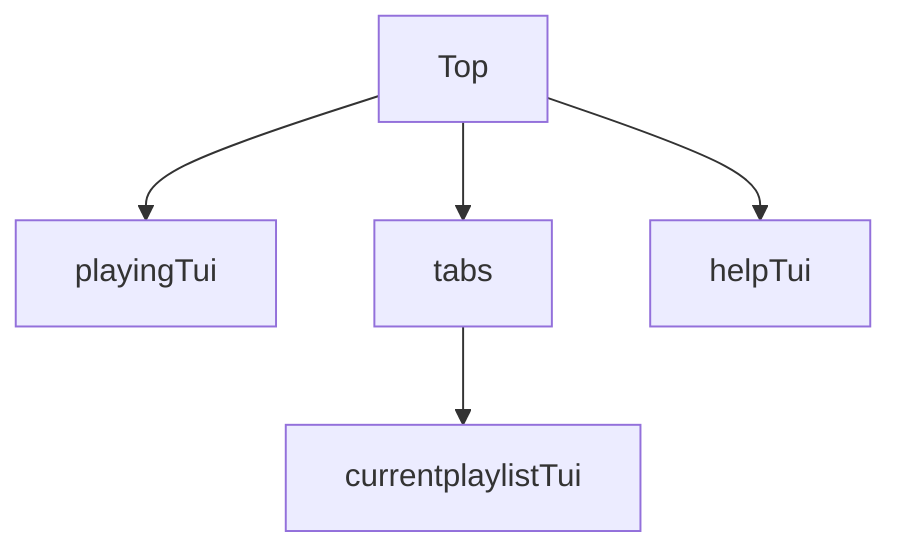

# lazyAppleMusic

this is an Apple Music TUI.  

## model

## BUG

-   remain time sync

## TODO

-   [x] direct play current select track
-   [ ] quick find current track in playlist
-   [ ] toggle random play
-   [ ] toggle repeat play
-   [ ] add user's playlist
-   [ ] search current playlist with input

## Maybe TODO

-   cache album, playlist...
-   add dev flow
-   add to `brew`
-   add to `awesome-tui`

## Thank this article help me build this project

[Tips for building Bubble Tea programs](https://leg100.github.io/en/posts/building-bubbletea-programs/)
