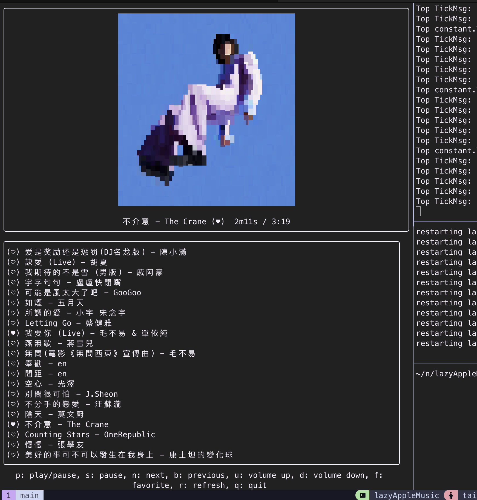

# lazyAppleMusic

this is an Apple Music TUI.

## model

## Thank this article help me build this project

[Tips for building Bubble Tea programs](https://leg100.github.io/en/posts/building-bubbletea-programs/)
