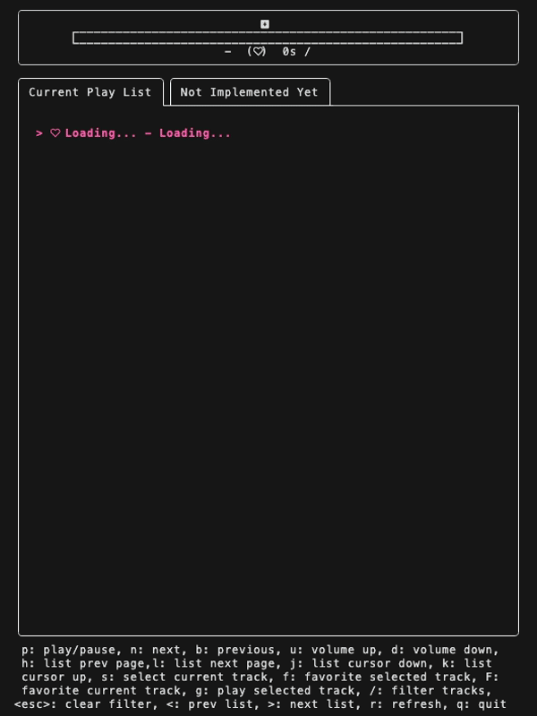

# lazyAppleMusic

this is an Apple Music TUI.  

## model

## BUG

- remain time sync
- `g` will change current playlist (when the track be founded in other playlist)

## TODO

- [x] direct play current select track
- [x] quick find current track in playlist
- [ ] toggle random play
- [ ] toggle repeat play
- [ ] add user's playlist
- [x] search current playlist with input
- [ ] play whole playlist

## Maybe TODO

- cache album, playlist...
- add dev flow
- add to `brew`
- add to `awesome-tui`
- multiselection and play
- add track to play later

## Thank this article help me build this project

[Tips for building Bubble Tea programs](https://leg100.github.io/en/posts/building-bubbletea-programs/)
